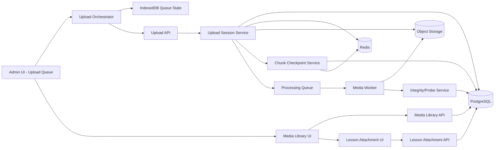
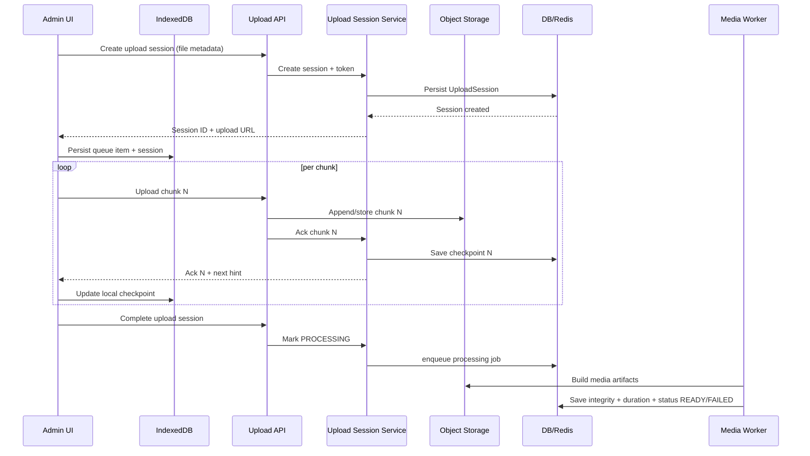

# System Architecture Diagram: Professional Media Upload & Lesson Attachment

## High-Level Components

## Upload Lifecycle

## Resilience Paths

- **Refresh/reopen**: UI restores queue from IndexedDB, fetches authoritative checkpoint from server, resumes from max acknowledged chunk.
- **Offline**: `navigator.onLine` and failed heartbeat move queue to `OFFLINE`; automatic resume on reconnect.
- **Server errors**: per-chunk retry with bounded backoff and jitter; fail item after max attempts while allowing other queue items to progress.
- **Checkpoint mismatch**: server checkpoint wins; client replays missing chunk(s) only.
